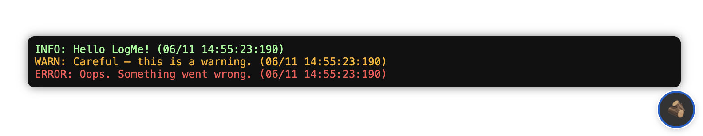

# 🪵 LogMe

> **A beautiful, lightweight logging overlay for your web applications**

LogMe brings your console logs directly into your browser with a sleek, non-intrusive overlay panel. Perfect for debugging, monitoring, and keeping track of what's happening in your application—without cluttering your browser's developer console.


---



---

## ✨ Features

- 🎨 **Beautiful UI** - Modern, dark-themed overlay that doesn't interfere with your app
- 🚀 **Zero Configuration** - Works out of the box with minimal setup
- 📊 **Color-Coded Logs** - Visual distinction between info, warnings, and errors
- ⏱️ **Precise Timestamps** - Every log entry includes detailed timestamps
- 🔄 **Real-Time Updates** - Logs appear instantly as they're generated
- 📱 **Non-Intrusive** - Toggle button stays out of the way until you need it
- 🎯 **TypeScript Support** - Full TypeScript definitions included
- 📦 **Lightweight** - Minimal bundle size, maximum impact
- 🔌 **Console Mirroring** - Logs also appear in your browser console
- 🎛️ **Event-Driven** - Subscribe to log events with custom callbacks

---

## 📦 Installation

### npm
```bash
npm install logme-js
```

### yarn
```bash
yarn add logme-js
```

### pnpm
```bash
pnpm add logme-js
```

---

## 🚀 Quick Start

### ES Modules (Recommended)

```html
<!DOCTYPE html>
<html>
<head>
  <title>My App</title>
</head>
<body>
  <script type="module">
    import { log } from './node_modules/logme-js/dist/index.js';
    
    // Start logging!
    log.info('Application started');
    log.warn('This is a warning');
    log.error('Something went wrong');
  </script>
</body>
</html>
```

### With a Bundler (Vite, Webpack, etc.)

```javascript
import { log } from 'logme-js';

log.info('Hello from LogMe!');
log.warn('Watch out!');
log.error('Error occurred');
```

---

## 📖 Usage

### Basic Logging

```javascript
import { log } from 'logme-js';

// Info logs (green)
log.info('User logged in', { userId: 123 });

// Warning logs (yellow)
log.warn('API rate limit approaching', { remaining: 5 });

// Error logs (red)
log.error('Failed to fetch data', error);
```

### Custom LogMe Instance

```javascript
import { LogMe } from 'logme-js';

const customLog = new LogMe();

customLog.info('This is a custom logger instance');
```

### Listening to Log Events

```javascript
import { log } from 'logme-js';

// Subscribe to all log events
log.onLog((entry) => {
  console.log('New log entry:', entry);
  // entry.type: 'info' | 'warn' | 'error'
  // entry.message: any[]
  // entry.timestamp: string
});

// Get all existing logs
const allLogs = log.getAll();
console.log('Total logs:', allLogs.length);
```

### Manual UI Initialization

```javascript
import { log, initLogMeUI } from 'logme-js';

// Initialize UI manually (usually automatic)
initLogMeUI();

// Now logs will appear in the overlay
log.info('UI initialized manually');
```

---

## 🎨 UI Overview

When you start logging, LogMe automatically creates:

- **🪵 Toggle Button** - A floating button in the bottom-right corner
- **📋 Log Panel** - A scrollable panel that appears when you click the button
  - Shows all log entries with color coding
  - Displays timestamps in `DD/MM HH:MM:SS:mmm` format
  - Auto-scrolls to show the latest entries

### Log Colors

- 🟢 **Info** - Green (`#9f9`)
- 🟡 **Warning** - Yellow (`#ffb400`)
- 🔴 **Error** - Red (`#f55`)

---

## 📚 API Reference

### `log`

The default `LogMe` instance exported from the package.

#### Methods

##### `log.info(...message: any[])`

Logs an info message.

```javascript
log.info('User action', { action: 'click', target: 'button' });
```

##### `log.warn(...message: any[])`

Logs a warning message.

```javascript
log.warn('Deprecated API used', 'Use new API instead');
```

##### `log.error(...message: any[])`

Logs an error message.

```javascript
log.error('API request failed', error, { url: '/api/data' });
```

##### `log.onLog(callback: (entry: LogEntry) => void)`

Subscribe to log events. The callback is called whenever a new log entry is created.

```javascript
log.onLog((entry) => {
  // entry.type: 'info' | 'warn' | 'error'
  // entry.message: any[]
  // entry.timestamp: string
});
```

##### `log.getAll(): LogEntry[]`

Returns an array of all log entries.

```javascript
const logs = log.getAll();
console.log(`Total logs: ${logs.length}`);
```

### `LogMe` Class

Create your own logger instance.

```javascript
import { LogMe } from 'logme-js';

const logger = new LogMe();
logger.info('Custom logger');
```

### `initLogMeUI()`

Manually initialize the UI overlay. Usually called automatically on first log.

```javascript
import { initLogMeUI } from 'logme-js';

initLogMeUI();
```

### Types

#### `LogEntry`

```typescript
interface LogEntry {
  type: 'info' | 'warn' | 'error';
  message: any[];
  timestamp: string; // Format: "DD/MM HH:MM:SS:mmm"
}
```

#### `LogType`

```typescript
type LogType = 'info' | 'warn' | 'error';
```

---

## 🎯 Use Cases

- **Development Debugging** - Keep track of application flow without opening DevTools
- **User Testing** - Show logs to users during testing sessions
- **Production Monitoring** - Display critical errors to users or support teams
- **API Integration** - Log API calls and responses in real-time
- **State Management** - Track state changes and transitions
- **Performance Monitoring** - Log performance metrics and timings

---

## 🔧 Development

### Building

```bash
npm run build
```

This compiles TypeScript source files from `src/` to `dist/`.

### Project Structure

```
logme/
├── src/
│   ├── index.ts      # Main entry point
│   ├── logme.ts      # Core logging functionality
│   └── ui.ts         # UI overlay implementation
├── dist/             # Compiled output
├── test.html         # Example usage
└── package.json
```

---

## 🤝 Contributing

Contributions are welcome! Please feel free to submit a Pull Request.

1. Fork the repository
2. Create your feature branch (`git checkout -b feature/AmazingFeature`)
3. Commit your changes (`git commit -m 'Add some AmazingFeature'`)
4. Push to the branch (`git push origin feature/AmazingFeature`)
5. Open a Pull Request

---

## 📝 License

This project is licensed under the MIT License - see the [LICENSE](LICENSE) file for details.

---

## 👤 Author

**Medwin Mirza**

- GitHub: [@medwin-mirza](https://github.com/medwin-mirza)
- Repository: [logme](https://github.com/medwin-mirza/logme)

---

## 🙏 Acknowledgments

- Built with TypeScript for type safety
- Inspired by the need for better logging experiences in web development

---

## ⭐ Show Your Support

If you find this project helpful, please consider giving it a star on GitHub!

---

**Made with ❤️ for developers who love clean, visual debugging**

